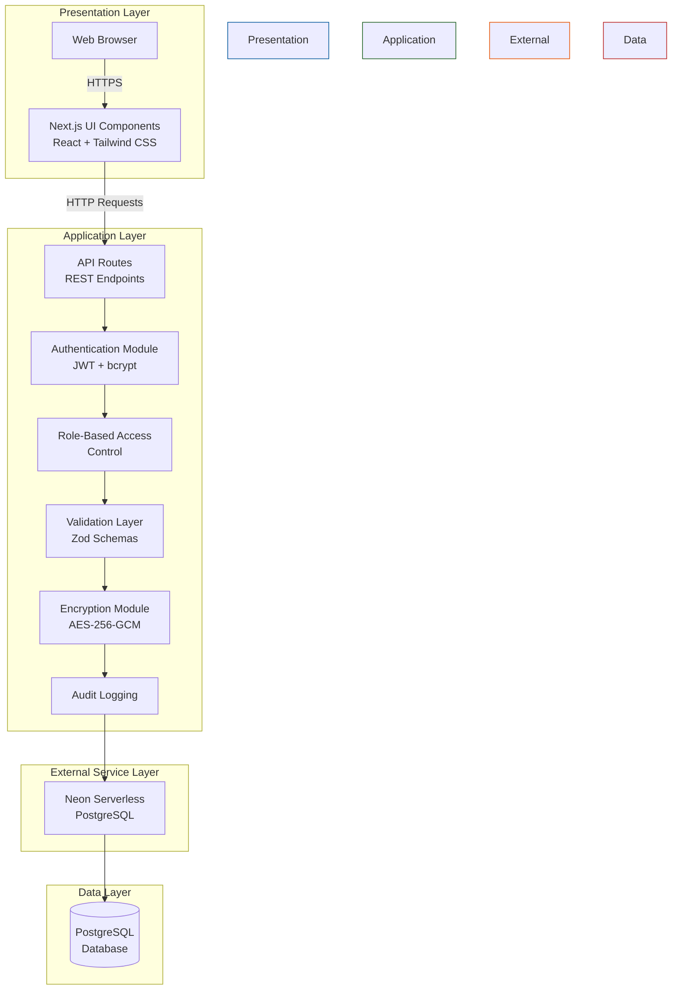
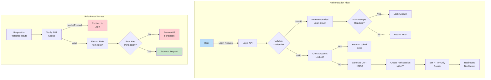
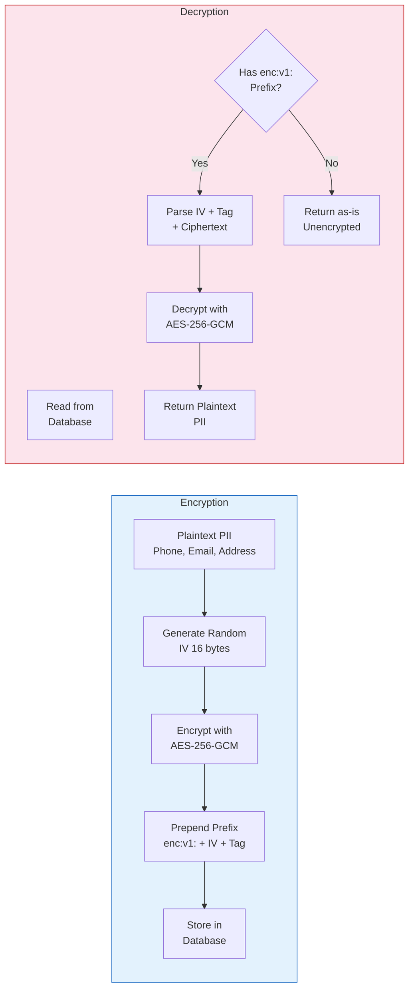

# CHAPTER 3: METHODOLOGY

## 3.0 INTRODUCTION

This chapter walks through how the Electronic Health Records (EHR) System was designed and built — the methods, the tools, the architecture decisions, and the security choices that shaped the final product. The EHR System is a secure, web-based platform built to help healthcare facilities manage patient records, streamline clinical workflows, and keep sensitive medical data safe.

Since we're building software, the project uses two complementary frameworks: Design Science Research (DSR) to guide the overall research and artefact creation, and a Secure Software Development Life Cycle (SSDLC) to make sure security wasn't bolted on at the end but baked in from day one.

The work followed the research objectives laid out in Chapter One. The methodology covers everything from figuring out what the system needed to do, designing the architecture, picking the right tools, threading security controls through the code, building the features, and finally testing whether the whole thing actually works.

The chapter breaks down into six sections:

- **Section 3.1** — why this counts as a software application project and why that matters
- **Section 3.2** — the methodological approach that drove development
- **Section 3.3** — the system's secure architecture and how the layers fit together
- **Section 3.4** — the tools and technologies used, with a full breakdown
- **Section 3.5** — threat modelling using the STRIDE framework
- **Section 3.6** — the actual implementation, from requirements through deployment

---

## 3.1 PROJECT DESIGN FOCUS

This is a software application project, plain and simple. The goal was never just to talk about the problems with paper-based health records — it was to build something that fixes them. The EHR System is a working platform that healthcare professionals can actually use every day: registering patients, documenting encounters, writing prescriptions, scheduling appointments, tracking inventory, and doing all of it with proper security guardrails.

The system is web-based and modular. Each major function lives in its own module — patient management, medical records (with diagnoses, prescriptions, and treatments nested inside), appointment scheduling, inventory tracking, user and role administration, audit logging, and a security dashboard for monitoring authentication activity and account lockouts. They all talk to each other through a shared backend.

Security had to be part of the foundation, not an afterthought. The system uses bcrypt-hashed passwords with account lockout protection, role-based access control so nurses can't accidentally do admin things, AES-256-GCM encryption for personally identifiable information at rest, HTTPS everywhere, secure sessions with JWT tokens, audit logging on every significant action, and strict access controls on administrative functions. These aren't features that got added late — they're structural.

Because the system handles sensitive health data, development followed the Secure Software Development Life Cycle. That meant security requirements were considered during architecture, implementation, testing, and deployment — not something to figure out after the fact. The result is a platform where data protection isn't a checkbox; it's how the thing works.

So the software application design focus was the right call. It let the project produce a practical, secure tool that actually improves how healthcare data gets managed, while showing what secure software engineering looks like in a sensitive domain.

---

## 3.2 METHODOLOGICAL APPROACH

The EHR System was built using Design Science Research as the overarching methodology. DSR fits because this project isn't just observing a problem — it's creating something to solve it. The whole point is to design, build, and evaluate a technological artefact that addresses a real-world need. In this case, that artefact is a secure electronic health records platform that helps healthcare facilities manage patient information, streamline workflows, and stay compliant with data protection requirements.

DSR works well here because the research goes beyond identifying what's wrong with how clinics manage records. It actually produces a working system — with authentication, role-based access, medical record management, appointment scheduling, inventory tracking, and audit logging — and then evaluates whether that system does what it's supposed to do.

On the software development side, the project adopted a Secure Software Development Life Cycle. The SSDLC takes the traditional SDLC and weaves security practices into every phase. That mattered here because the EHR System manages patient health information that's protected by law and ethical obligations. It would be pretty strange to build a health records system without taking security seriously from the start.

Development was iterative. The first phase was requirements analysis — figuring out what the system actually needed to do by looking at existing EHR systems, reading up on healthcare data management, and working from the research objectives. This phase made sure the platform would solve real problems for real users: physicians, nurses, receptionists, and administrators.

The second phase was system design — planning the architecture, defining modules, mapping out the database schema with its eight interconnected models, designing navigation flows, and figuring out where security mechanisms like encryption, authentication, and access control would live.

Then came implementation. Each module — authentication, patient management, medical records, appointments, inventory, user management, audit logging, security dashboard — was built and tested independently before being integrated into the full platform. Throughout, coding practices focused on avoiding common vulnerabilities.

After implementation came testing. Functional testing made sure features worked. Integration testing checked that modules talked to each other correctly. Security testing verified authentication, encryption, access controls, and API communication all held up.

The combination of DSR and SSDLC meant the EHR System got built in a structured way, with security embedded from the start, and with a clear framework for evaluating whether it actually works.

---

## 3.3 SECURE DESIGN ARCHITECTURE

The architecture was designed around one principle: security isn't a layer you add — it's how you build. Since the EHR System handles patient health information protected by regulation, every architectural decision had to account for confidentiality, integrity, and availability.

The system uses a four-layer architecture: presentation, application, external service, and data. Figure 3.1 shows how they fit together.



**Figure 3.1: High-Level System Architecture of the EHR System**

The presentation layer is what users see and interact with — React components styled with Tailwind CSS, rendered server-side by Next.js for performance. Through this interface, clinicians and administrators access patient records, document encounters, schedule appointments, manage inventory, and handle administrative tasks.

The application layer is where the logic lives. It handles authentication and authorisation, decides who can see or do what based on their role, validates every piece of data coming in using Zod schemas, encrypts and decrypts sensitive fields, and records audit trails for anything important. This layer runs as Next.js API routes and server components.

The external service layer connects to Neon, a serverless PostgreSQL platform that handles the database infrastructure. It scales automatically, stays highly available, and saves the hassle of managing a database server directly.

The data layer is where everything gets stored — eight models covering roles, users, authentication sessions, patients, medical records (with their diagnoses, prescriptions, and treatments), appointments, inventory supplies, and audit logs.

Authentication works like this: passwords get hashed with bcrypt at 12 salt rounds. On successful login, the server issues a JWT signed with HS256 that carries the user's identity and role. The token goes into an HTTP-only cookie so client-side JavaScript can't touch it. Each session gets a unique JTI (JWT ID) stored in both the token and the database for tracking and revocation.



**Figure 3.2: Authentication and Authorisation Flow**

The system defines four roles — Administrator, Doctor, Nurse, and Receptionist — and each one gets permissions that match their job. Receptionists can register patients and schedule appointments but can't touch clinical records. Doctors can document encounters and prescribe medications. Nurses can view and update records within their scope. Administrators handle user management, system configuration, and audit log review. This separation means nobody accidentally — or intentionally — operates outside their lane.

One of the more important pieces is how the system handles personally identifiable information. Patient phone numbers, email addresses, and physical addresses get encrypted at rest using AES-256-GCM, the same standard used in many enterprise encryption systems. Each field gets its own random 16-byte initialization vector, and the ciphertext carries an authentication tag that prevents tampering. The encrypted values are prefixed with `enc:v1:` so the system knows which fields to decrypt and which to leave alone.



**Figure 3.3: Field-Level PII Encryption and Decryption Flow Using AES-256-GCM**

The decryption happens transparently — authorized users see the plaintext without ever knowing encryption happened. If someone were to dump the database directly, they'd find nothing but encrypted blobs and unreadable fields.

Session management uses the JTI pattern. Each login creates a unique session identifier stored in the database and embedded in the JWT. When a user logs out, the session gets revoked. If a session expires or gets tampered with, the system forces a re-login. Account lockout adds another layer — after a configurable number of failed login attempts, the account gets temporarily disabled to slow down brute-force attacks.

Beyond authentication, the system follows OWASP Top 10 guidelines. Input validation via Zod catches malformed or malicious data before it reaches the database. Route-level and API-level access controls prevent unauthorized access even if someone crafts a direct request. Secure coding practices were followed throughout to minimize the surface area for common web vulnerabilities.

The architecture as a whole makes sure the EHR System isn't just a tool for managing health records — it's a demonstration of what secure software development looks like when you take it seriously from the start.

---

## 3.4 TOOLS AND TECHNOLOGIES

Building the EHR System meant picking tools that were reliable, performant, secure, and fit for purpose. Table 3.1 breaks down every major technology used, what it did, and why it was chosen.

**Table 3.1: Tools and Technologies Used in the Development of the EHR System**

| Tool/Technology | Version | Purpose | Justification |
|---|---|---|---|
| Next.js | 16.2.10 | Full-stack web framework | Handles both frontend and backend in one project with built-in routing, server-side rendering, and API routes. |
| React | 19.2.4 | User interface library | Powers the interactive UI components within Next.js — reusable, component-based, and well-supported. |
| TypeScript | 5.x | Programming language | Catches type errors at compile time rather than runtime, making the codebase more maintainable and less error-prone. |
| Tailwind CSS | 4.x | CSS framework | Utility-first approach makes it fast to build consistent, responsive interfaces without writing custom CSS. |
| Prisma | 7.8.0 | ORM and database toolkit | Type-safe database queries, auto-generated client, schema migrations — everything needed to work with PostgreSQL cleanly. |
| PostgreSQL (Neon) | Latest | Database | Serverless PostgreSQL that scales automatically, stays highly available, and removes the operational overhead of managing a database server. |
| bcryptjs | 3.0.3 | Password hashing | Industry-standard algorithm with configurable cost factor — passwords get hashed at 12 rounds. |
| jsonwebtoken | 9.0.3 | JWT authentication | Issues signed tokens carrying user identity and role for stateless API authentication. |
| Zod | 4.4.3 | Schema validation | Validates every user input and API request body against defined schemas, preventing malformed or malicious data from reaching the database. |
| Radix UI | Latest | Accessible UI primitives | Unstyled, accessible components for dialogs, dropdowns, selects, tabs, and tooltips — handles the hard accessibility stuff so we don't have to. |
| Framer Motion | 12.42.2 | Animation library | Adds smooth transitions and micro-interactions that make the interface feel polished. |
| Lucide React | 1.23.0 | Icon set | Consistent, clean vector icons used throughout the interface. |
| Node.js Crypto | Built-in | Encryption | AES-256-GCM encryption/decryption for PII fields — no external dependency needed, it's in the standard library. |
| Visual Studio Code | Latest | Code editor | Primary development environment with TypeScript support, debugging, and Git integration. |
| Git and GitHub | Latest | Version control | Source code management, change tracking, and collaboration throughout development. |
| Vercel | Latest | Hosting and deployment | Deploys the Next.js app with automatic HTTPS, global CDN, serverless functions, and continuous deployment from GitHub. |
| Google Chrome | Latest | Browser testing | Used to verify functionality, responsiveness, and compatibility during development. |

Next.js was the backbone. It handled the frontend with React components and the backend with API routes, all in one project. TypeScript kept the code reliable — catching type mismatches during development rather than in production. Tailwind CSS made the UI consistent without fighting with stylesheets.

Prisma was the bridge to the database. It generated a type-safe client that made queries predictable and safe, handled schema migrations so the database stayed in sync with the code, and supported the Neon adapter for serverless PostgreSQL. The schema defined eight models with clear relationships — users belong to roles, patients have records, records contain diagnoses and prescriptions and treatments, appointments link patients to clinicians, and every significant action gets logged in the audit trail.

Security libraries did the heavy lifting on data protection. bcryptjs handled password hashing at 12 rounds. jsonwebtoken managed stateless authentication with HS256-signed tokens. Node.js's built-in crypto module handled AES-256-GCM encryption for PII — no extra package needed. Zod validated every input to prevent injection attacks and data corruption.

Supporting tools filled in the gaps. Visual Studio Code was the daily driver for writing and debugging code. Git tracked every change. Vercel handled deployment with automatic HTTPS and global distribution. Chrome was the primary test browser throughout development.

---

## 3.5 THREAT MODELLING AND RISK ANALYSIS

Before writing production code, we walked through what could go wrong. Threat modelling was done early in the design phase to identify security risks before they became vulnerabilities in deployed code. This proactive approach is core to the SSDLC — fix it in design, not in production.

The STRIDE framework, developed by Microsoft, was used to categorize threats. STRIDE stands for Spoofing, Tampering, Repudiation, Information Disclosure, Denial of Service, and Elevation of Privilege. Each category was analyzed against the EHR System's components, and mitigations were built into the architecture.

**Table 3.2: STRIDE Threat Model for the EHR System**

| STRIDE Category | Potential Threat | Possible Impact | Mitigation Implemented |
|---|---|---|---|
| **Spoofing** | Someone pretends to be a legitimate user or administrator. | Unauthorized access to patient records and sensitive health data. | bcrypt-hashed passwords, HS256 JWTs, account lockout after failed attempts, HTTP-only cookies for session tokens — makes impersonation significantly harder. |
| **Tampering** | A user modifies patient records, diagnoses, prescriptions, or inventory data without authorization. | Data integrity loss that could lead to incorrect treatment or inventory mismanagement. | Role-based access control restricts write operations to authorized roles only. Zod validation prevents malformed data. Database constraints enforce referential integrity. |
| **Repudiation** | A user denies performing an action like creating a record, updating a patient, or deleting an appointment. | Hard to verify who did what, making accountability and compliance difficult. | Every create, update, and delete operation is logged with user ID, timestamp, IP address, and action details in the audit log. There's a permanent record. |
| **Information Disclosure** | Patient medical records, PII, or login credentials are exposed to unauthorized parties. | Loss of patient confidentiality, privacy breaches, legal liability. | AES-256-GCM encryption of PII at rest, HTTPS for all communications, secure session management, role-based restrictions on data access, and hashed passwords. |
| **Denial of Service (DoS)** | An attacker overloads the platform or exhausts database connections. | System becomes unavailable, interrupting clinical workflows and patient care. | Efficient query patterns, Neon's built-in connection pooling, rate limiting on auth endpoints, and Vercel's scalable infrastructure help absorb traffic spikes. |
| **Elevation of Privilege** | A nurse or receptionist tries to gain admin-level access. | Unauthorized modification of system configuration, user accounts, or sensitive data. | Role-based access control is enforced at both the route level and the API level. Permissions are verified server-side, not just in the UI. Admin interfaces are completely separated from user workflows. |

Going through the STRIDE exercise early meant the team could address these threats in the architecture rather than scrambling to patch them after deployment. Authentication, encryption, access control, input validation, session management, account lockout, and audit logging — they all trace back to specific threats identified during this phase.

The process also reinforced the secure-by-design philosophy. The EHR System doesn't just teach cybersecurity concepts — it demonstrates them through its own architecture. Every control, from the encryption of a single phone number to the role check on an API endpoint, exists because a threat was identified and a decision was made to address it.

---

## 3.6 DESIGN IMPLEMENTATION PROCEDURES

Implementation followed the SSDLC from start to finish. Each phase built on the last, from figuring out what the system needed to do, all the way through to deployment and testing.

### 3.6.1 Requirements Analysis

The first step was figuring out what the EHR System actually needed to do. Functional requirements came from the research objectives, a review of existing EHR systems, and the practical needs of healthcare facilities. The list included user registration and authentication with role-based access, patient registration and management, medical record creation with support for structured diagnoses (including ICD-10 codes), prescriptions, and treatments, appointment scheduling and management, medical inventory and supplies tracking, user and role administration, comprehensive audit logging, and security monitoring.

Non-functional requirements covered performance, security, usability, scalability, and reliability. Patient PII had to be encrypted at rest. All communications had to happen over HTTPS. Passwords needed strong hashing. Every access to protected resources required authentication and authorization. The system had to remain responsive under concurrent clinical use.

### 3.6.2 System Design

With requirements in hand, the architecture took shape. The system was structured as interconnected modules — authentication and session management, patient management, medical records (with sub-modules for diagnoses, prescriptions, and treatments), appointment scheduling, inventory and supplies management, user and role administration, audit logging, and a security monitoring dashboard.

The database schema went through several iterations before settling on eight models. Figure 3.4 shows the final entity-relationship design.

```mermaid
erDiagram
    Role ||--o{ User : has
    User ||--o{ AuthSession : owns
    User ||--o{ MedicalRecord : creates
    User ||--o{ Appointment : schedules
    User ||--o{ AuditLog : generates
    Patient ||--o{ MedicalRecord : has
    Patient ||--o{ Appointment : attends
    MedicalRecord ||--o{ RecordDiagnosis : contains
    MedicalRecord ||--o{ RecordPrescription : prescribes
    MedicalRecord ||--o{ RecordTreatment : documents

    Role {
        int roleId PK
        string roleName UK
        string description
        string isSystem
    }

    User {
        int userId PK
        int roleId FK
        string username UK
        string displayName
        string email UK
        string passwordHash
        string isActive
        int failedLoginCount
        datetime lockedUntil
        string mfaEnabled
        datetime lastLoginAt
    }

    AuthSession {
        int sessionId PK
        int userId FK
        string jti UK
        datetime expiresAt
        datetime revokedAt
        string ipAddress
    }

    Patient {
        int patientId PK
        string mrn UK
        string firstName
        string lastName
        datetime dateOfBirth
        string sex
        string phoneNumber ENC
        string email ENC
        string addressLine1 ENC
    }

    MedicalRecord {
        int recordId PK
        int patientId FK
        int createdByUserId FK
        string recordType
        string title
        string clinicalNote
        string recordStatus
        datetime encounterDate
    }

    RecordDiagnosis {
        int diagnosisId PK
        int recordId FK
        string diagnosisName
        string icd10Code
        string diagnosisStatus
        string isPrimary
    }

    RecordPrescription {
        int prescriptionId PK
        int recordId FK
        string medicationName
        string dosage
        string frequency
        string route
        int durationDays
    }

    RecordTreatment {
        int treatmentId PK
        int recordId FK
        string treatmentName
        string outcome
        string notes
    }

    Appointment {
        int appointmentId PK
        int patientId FK
        int scheduledByUserId FK
        int clinicianUserId FK
        datetime appointmentDate
        string appointmentType
        string status
        string reason
    }

    InventorySupply {
        int supplyId PK
        string name
        string category
        int quantity
        string unit
        int reorderLevel
        decimal unitCost
        datetime expiryDate
        string batchNumber
    }

    AuditLog {
        int auditLogId PK
        int userId FK
        string actionType
        string entityName
        string entityId
        string details
        string ipAddress
        datetime createdAt
    }
```

**Figure 3.4: Entity-Relationship Diagram of the EHR System Database Schema**

The UI was designed around clinical workflows — getting users to what they need with minimal friction. Wireframes evolved through several rounds of refinement based on usability feedback.

### 3.6.3 System Development

Implementation happened module by module. Each component was built, tested, and then integrated into the larger system.

Authentication came first — bcrypt hashing on signup, JWT generation on login, session tracking, cookie management, account lockout. Then patient management with automatic medical record number generation. Then medical records with structured fields for ICD-10 coded diagnoses, prescription details (dosage, frequency, route, duration), and treatment tracking. Appointments followed, with scheduling, clinician assignment, and status tracking. Inventory management added low-stock alerts and expiry warnings. Audit logging tied everything together, recording every create, update, and delete operation.

The database layer used Prisma for type-safe queries and migration management. The schema defined eight models with clear relationships. Migrations were generated and applied to the Neon PostgreSQL instance, keeping the database in sync with the code.

The encryption module was built using Node.js's built-in crypto library. Before PII fields get written to the database, they pass through the encryption function, which generates a random IV, encrypts with AES-256-GCM, and prepends the `enc:v1:` marker. On read, the decryption function checks for the marker, parses out the IV and authentication tag, decrypts, and returns the plaintext. The whole thing is transparent to the rest of the application — calling code just reads and writes fields normally.

### 3.6.4 Integration of External Services

The EHR System connects to two main external services. Neon PostgreSQL handles the database — it's fully managed, serverless, and scales automatically. The `@prisma/adapter-neon` package bridges Prisma to Neon's WebSocket-based serverless driver.

Vercel hosts the application. It integrates directly with the Next.js framework, provides automatic HTTPS and global CDN distribution, runs API routes as serverless functions, and supports continuous deployment from the GitHub repository. Environment variables — database URL, JWT secret, encryption key — are configured through Vercel's dashboard and injected at build time.

### 3.6.5 System Testing

Testing wasn't a separate phase at the end — it happened continuously. Each module was tested individually as it was built: authentication flows, patient CRUD operations, medical record creation with nested diagnoses and prescriptions, appointment scheduling with different status transitions, inventory management with quantity updates and reorder alerts.

Integration testing verified that modules communicated correctly — that the authentication module properly secured API routes, that medical records correctly linked to their parent patients, that appointments resolved the right clinician and scheduler. UI testing checked responsiveness across screen sizes and browsers. Security testing confirmed that encryption worked, access controls held, sessions expired properly, and audit logs captured the right information.

Bugs were fixed as they were found. Nothing went to deployment without passing through this process.

### 3.6.6 System Deployment

The final production build was generated using Next.js's build toolchain, which compiles the application into optimized static files and serverless functions. The build output confirmed 23 routes compiled successfully — covering authentication, patient management, medical records, appointments, inventory, audit logs, and security monitoring.

Deployment to Vercel went through the standard pipeline: environment variables configured, build triggered, assets distributed across the global CDN. Post-deployment testing confirmed that every feature worked in production — login, patient registration, record creation, appointment scheduling, inventory management, and administrative functions. Role-based access control was verified to restrict permissions correctly. Encryption was confirmed to protect PII at rest. Audit logs were confirmed to capture all significant operations.

The result is a secure, modular, production-ready EHR System that improves how healthcare facilities manage patient data while keeping that data protected through every layer of the stack.
